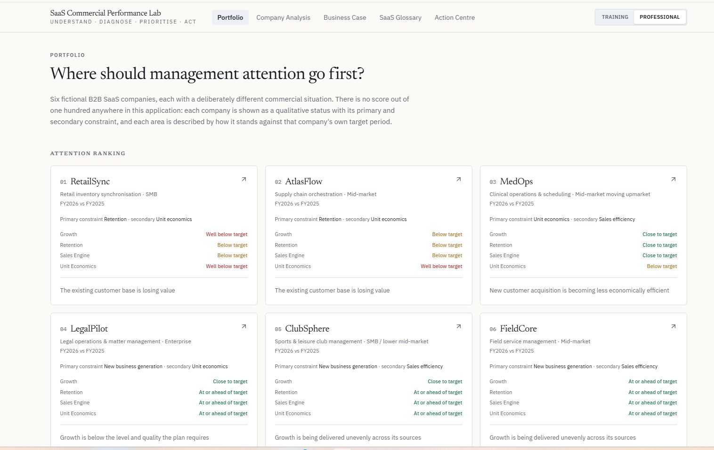

# SaaS Compass

**SaaS Commercial Performance Lab**

An applied learning and business analysis project designed to explore how SaaS metrics connect to commercial performance and management decision-making.

The project uses fictional B2B SaaS companies and business cases to move beyond individual metrics and analyse how growth, retention, sales performance and unit economics interact.
## Application Preview

## What the project explores

- ARR and MRR growth
- Customer churn and retention
- GRR and NRR
- CAC and LTV
- Unit economics
- Sales efficiency and conversion
- Commercial performance KPIs
- SaaS profitability and growth trade-offs
- Business case analysis
- Management prioritisation and action planning

## Structure

### Portfolio
Comparison of fictional B2B SaaS companies with different commercial situations, identifying the areas that require management attention.

### Company Analysis
Structured analysis of commercial performance across key areas such as growth, retention, sales engine and unit economics.

### Business Case
Business cases designed to connect SaaS metrics with commercial diagnosis and management decisions.

### SaaS Glossary
Reference area covering key SaaS concepts and metrics used throughout the project.

### Action Centre
Translation of analysis into priorities and concrete management actions.

## Purpose

SaaS Compass is an **applied learning and analysis project**.

It was created to deepen my understanding of SaaS business models and to practise interpreting commercial and financial metrics in context rather than analysing KPIs in isolation.

All companies and business scenarios used in the project are fictional and created for learning and analysis purposes.

## Approach

**Understand → Diagnose → Prioritise → Act**

The objective is not simply to calculate SaaS metrics, but to understand what they reveal about a business, identify the most relevant commercial constraints and translate those insights into management priorities.

---

Created by Ramón López Sánchez.
